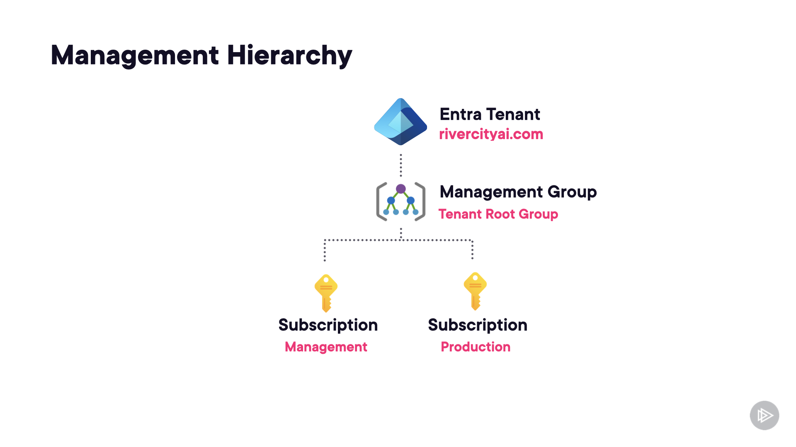

# Case Study 1: River City AI

<strong>Overview</strong>

River City AI specializes in optimizing speech to text for efficiency and accuracy using machine learning.

River City AI is already using Amazon Web Services and due to the success and capabilities of Microsoft’s Data and AI services, they are looking to adopt a multi-cloud environment to drive innovation.

<strong>Existing Environment</strong>

Azure Management Hierarchy

 * The Azure management hierarchy consists of the tenant root management group and two subscriptions
 * The Management subscription is used for shared management resources like a Log Analytics workspace
 * The Production subscription is used for production workloads
 * Azure policy is used to govern all subscriptions, policies and initiatives are linked to the tenant root management group for this purpose

  

AWS Environment

* A SQL Server Windows Virtual Machine (EC2 instance) is running on AWS
* The SQL Server database is 200GB in size
* New orders are submitted using a single page web application (SPA) hosted in Amazon S3, and sent for the backend processing as events
* Order events are processed by 5 Windows Virtual Machine (EC2 instances) using a Windows service written in C#, that listens for order events
* A proof-of-concept project has been completed, confirming that the event processing service an be containerized

Problem Statements

* Virtual machines do not have anti-malware protection installed
* Cloud Administrators can create virtual machines with Public IP addresses and management ports open to the Internet
* Virtual machines spent lots of time idle when not processing orders, increasing cloud expenditure

<strong>Requirements</strong>

Business Goals

* River City AI must ensure security of their data
* Costs must be minimized wherever possible
* River City AI wants to foster a culture of innovation

Planned Changes

* All SQL databases will be migrated to Azure
* All workloads running on Windows virtual machines will be migrated to Azure

Technical Requirements

* River City AI wants to minimize administrative overhead
* User-initiated copy-only backups are required for all SQL databases

Test Environment

* The application development team wants to have full control over the management of their resources, including configuring Azure Role-based access control (RBAC)
* The application development team must not be able configure or override Azure Policy
* Application testing requires the use of new services and new configurations that are not permitted in production environments

