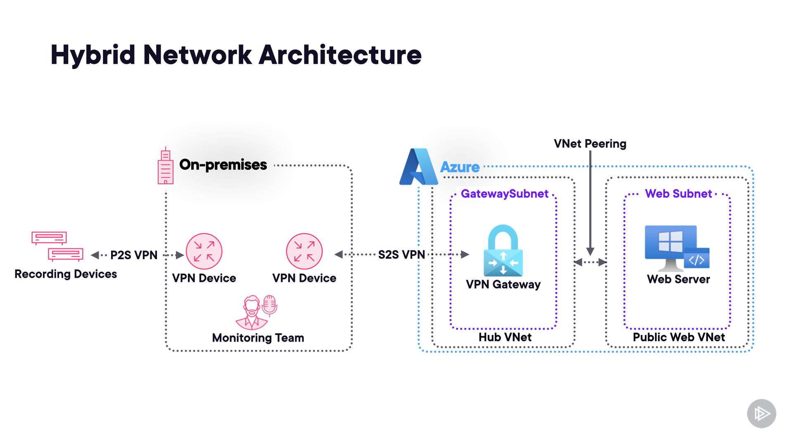
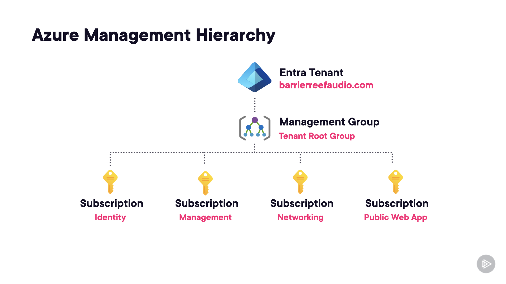
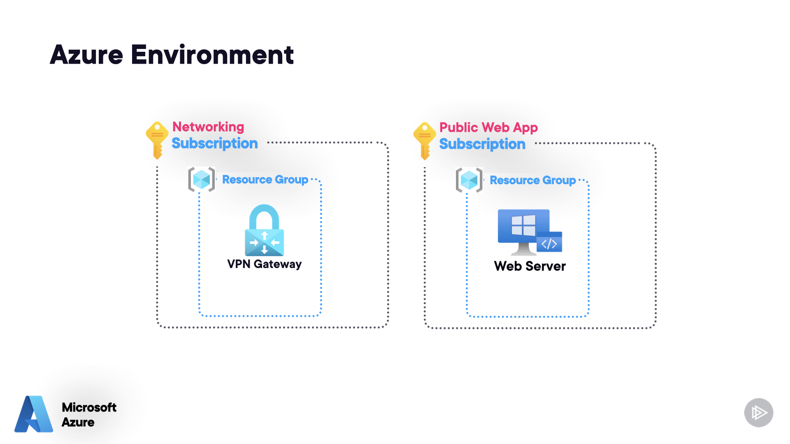

# Case Study 2: Barrier Reef Audio

<strong>Overview</strong>

Barrier Reef Audio is a company that focuses on recording high quality audio that can be used to generate subtitles and text transcripts from speech using a range of high quality audio equipment.

Barrier Reef Audio planning to migrate to Azure. They have a hybrid cloud strategy.

<strong>Existing Environment</strong>

Identity

 * Two Active Directory Domain Services (AD DS) Domain Controllers are deployed on-premises
 * Entra Cloud Sync is configured, and identities are being synchronized from AD DS to Entra ID
 * Two cloud-only break-glass global administrator accounts have been created

Networking

 * A Point-to-Site (P2S) VPN connection is used to connect recording devices to the on-premises network
 * A Site-to-Site (S2S) VPN connection is used to provide hybrid network connectivity between the on-premises network and the Azure virtual network
 * Two virtual networks have been deployed to Azure, including a Hub Virtual Network in the networking subscription and a Public Web subnet in the Public Web App subscription

 

Azure Management Hierarchy

 * The following subscriptions have been created:
	* Identity
	* Management
	* Networking
	* Public Web App
* All subscriptions are located under the Management Group: Tenant Root Group 

 

Azure Environment

* A VPN gateway has been deployed to the _Networking_ subscription
* A single IIS Web Server has been deployed to the _Public Web App_ Subscription, it hosts a public-facing web app

 

Problem Statements

 * Data center storage is near capacity and new hardware is not being provisioned
 * All storage on-premises is the same tier, using spinning hard-disk (HDD) backed storage
 * The current in-house recording monitoring solution has been deprecated and will not be supported on new versions of Windows 11
 * The public-facing web app has frequent down-time

<strong>Requirements</strong>

Business Goals

* Barrier Reef Audio has a high priority on the security of it's data
* Barrier Reef Audio must meet contractual obligations with it's customers
* All policies must be configured by a central Cloud Center of Excellence (CCoE) governance team
* Barrier Reef Audio wants to minimize costs whenever possible

Planned Changes

* Recording device monitoring will be migrated to a new solution using Power BI dashboards
* All on-premises infrastructure will eventually be migrated to Azure

Audio Storage Requirements

* Barrier Reef Audio requires their core recording services are highly available
* Audio files must be replicated to a secondary region, and be readable at all times
* After the first 60 days, audio files are infrequently used

Contractual Requirements

* Virtual machines must not be directly accessible from the Internet
* Virtual machine storage must be encrypted at rest
* Traffic from storage accounts must be encrypted in transit

Recording Devices

* Each recorder has up to 4 microphones connected
* The volume level of each microphone is sent to the recorder as telemetry
* A central monitoring team monitors the recording level of each microphone and must respond to a low/no volume microphone

